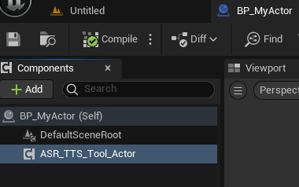
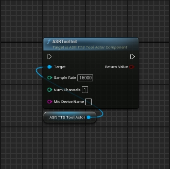
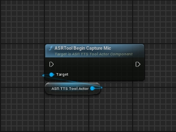
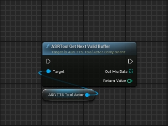
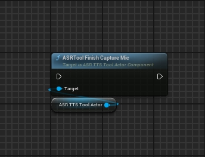
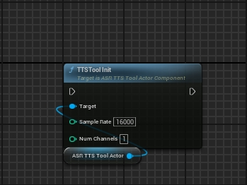
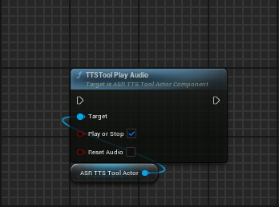
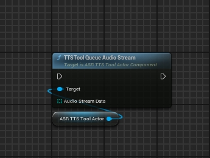

# ASR_TTS_Tool_UE5

Capture microphone audio for ASR,play audio stream from TTS.

The plugin contains an actor component, which can be attached to any actor.



The plugin provides the functionality to capture microphone audio data which can be sent to the ASR server for speech recognition.

The plugin also provides the functionality to play the audio stream obtained from the TTS service.


# ASR Tool

First, you need to add following lines to `DefaultEngine.ini` of the project.
```
[Voice]
bEnabled = True
[SystemSettings]
voice.SilenceDetectionThreshold = -1
voice.MicNoiseGateThreshold = -1
```

Initialize the voice capture object

SampleRate: sampling rate of voice capture

NumChannels: number of channels to capture

MicDeviceName: name of device to capture audio data with, empty for default device



Start capturing voice And store the audio data in Buffer



After capturing Voice, it should be called every 0.1 seconds to obtain valid audio data and send it to the ASR server,The frequency is modified according to the requirements of ASR services.



Stop capturing voice




# TTS Tool

Create AudioComponent and ProceduralWave

SampleRate: sampling rate of procedural soundwaves

NumChannels: number of channels for procedural soundwaves



PlayOrStop: If Play,auto play audio when queue audio stream.

ResetAduio: If ResetAudio,Remove all queued data.



Queue Audio Data From TTS Server


